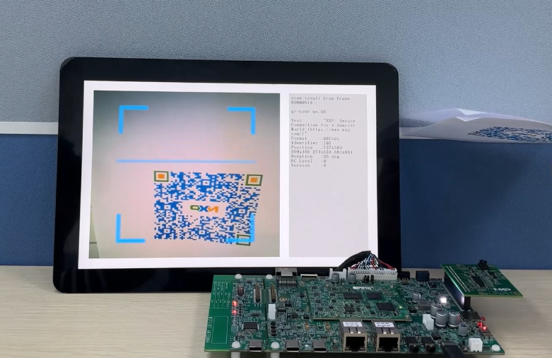
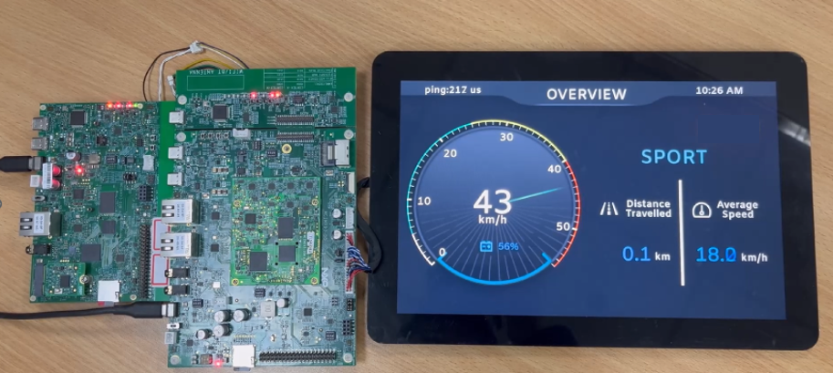

## Zephyr demo running on i.MX93

<!----- Boards ----->
[](./Apache-2.0.txt)
[](https://github.com/search?q=org%3Anxp-appcodehub+MCIMX93-EVK+in%3Areadme&type=Repositories)
[](https://github.com/search?q=org%3Anxp-appcodehub+MCIMX93-QSB+in%3Areadme&type=Repositories)
[](https://github.com/search?q=org%3Anxp-appcodehub+hmi+in%3Areadme&type=Repositories) 
[](https://github.com/search?q=org%3Anxp-appcodehub+graphics+in%3Areadme&type=Repositories) 
[](https://github.com/search?q=org%3Anxp-appcodehub+rtos+in%3Areadme&type=Repositories)
[](https://github.com/search?q=org%3Anxp-appcodehub+display+in%3Areadme&type=Repositories)

These are highly illustrative Zephyr RTOS demo projects tailored specifically to run on the i.MX93 MPU. Specifically, the Digital Cluster demo and the Barcode Scanner demo demonstrate the exceptional capabilities of Zephyr RTOS in a hands-on manner. The Digital Cluster demo showcases the real-time performance of Zephyr RTOS, emphasizing its ability to handle multiple tasks simultaneously with minimal latency. This is crucial for applications requiring precision timing and quick response.

The Barcode Scanner demo, on the other hand, highlights the speed of Zephyr RTOS's boot process. Compared to RT-Linux, Zephyr RTOS boasts a significantly faster boot time, which is essential for scenarios where quick initialization is paramount.

Furthermore, the lightweight nature of Zephyr RTOS is also evident in these demo projects. Its efficient memory management and minimal resource consumption ensure that even resource-constrained devices can leverage its capabilities effectively. This is a significant advantage compared to RT-Linux, which tends to be heavier and more resource-intensive.

1. [Software](#step1)
2. [Hardware](#step2)
3. [Setup](#step3)
4. [Results](#step4)
5. [FAQs](#step5) 
6. [Support](#step6)
7. [Release Notes](#step7)

## 1. Software<a name="step1"></a>

- [Zephyr](https://github.com/nxp-zephyr/zephyr/tree/gh-release/imx93_zephyr_poc)

Zephyr is an operating system that includes a HAL component.

- [Zephyr Hal](https://github.com/nxp-zephyr/hal_nxp/tree/gh-release/imx93_zephyr_poc)

The HAL provides an abstraction layer for interacting with hardware, allowing developers to write hardware-independent code.

- [Zephyr Sample](https://github.com/nxp-imx-support/zephyr_samples)

The sample part indicates these are example implementations or demonstrations of how to use the Zephyr HAL.

These HAL samples help developers learn how to leverage the Zephyr HAL to build applications that can run on different hardware platforms without needing to modify the core code.

## 2. Hardware<a name="step2"></a>

- [i.MX 93 EVK Board](https://www.nxp.com/products/processors-and-microcontrollers/arm-processors/i-mx-applications-processors/i-mx-9-processors/i-mx-93-applications-processor-family-arm-cortex-a55-ml-acceleration-power-efficient-mpu:i.MX93)
- MT9M114
- Personal Computer
- TF Card Reader
- TF Card

## 3. Setup<a name="step3"></a>

### 3.1 Step1

#### Setup Zephyr Project

To setup Zephyr project, refer to [Getting Started Guide - Zephyr Project Documentation](https://docs.zephyrproject.org/3.5.0/develop/getting_started/index.html).

Note that when running `west init ~/zephyrproject` command, use the following command instead:

```shell
$ west init -m https://github.com/nxp-zephyr/zephyr -mr gh-release/imx93_zephyr_poc ~/zephyrproject
```

Other steps are the same.

### 3.2 Step2

#### Build Demo App

To build a demo app, first clone this repository under `~/zephyrproject` :

```shell
$ cd ~/zephyrproject
$ git clone -b gh-release/imx93_zephyr_poc --single-branch https://github.com/nxp-imx-support/zephyr_samples.git
```

Then build with following commands:

```shell
$ cd ~/zephyrproject/zephyr
$ west build -b ${BOARD} ${PATH_TO_DEMO}
```

For example, to build `barcode_scanner` demo, use `west build -b mimx93_evk_a55 ../zephyr_samples/barcode_scanner` .

The result binary is `~/zephyrproject/zephyr/build/zephyr/zephyr.bin` .

### 3.3 Step3

#### Run Zephyr Demo using SPL Boot

Instead of using u-Boot to load Zephyr binary, SPL boot is used to minimize boot time. To run these demo, [mkimage](https://github.com/nxp-imx/imx-mkimage) tool must be used. To learn how to set up mkimage tool, please refer to chapter 4.5.13 of [i.MX Linux User's Guide](https://www.nxp.com/docs/en/user-guide/IMX_LINUX_USERS_GUIDE.pdf).

Assuming that mkimage tool is set up at `$MKIMAGE` dirctory, and Zephyr build directory is `$BUILD` (`~/zephyrproject/zephyr/build` if following above steps) , run following commands:

```shell
$ cp $BUILD/zephyr/zephyr.bin $MKIMAGE/iMX9/u-boot.bin
$ cd $MKIMAGE
$ make SOC=iMX9 REV=A1 flash_singleboot
```

The mkimage writes bootable binary to `$MKIMAGE/iMX9/flash.bin` . Write the binary to SD card with following command (replace `/dev/sdX` to actual device):

```shell
$ dd if=$MKIMAGE/iMX9/flash.bin of=/dev/sdX bs=1k seek=32 conv=fsync
```

Insert SD card to the board, boot from SD card to run Zephyr demo. The Zephyr shell can be accessed via LPUART1 with setting of `115200-8-1-0-0` . If connect via on-board debug USB to UART bridge, select 3rd COM/TTY device on the host.

### 3.4 Step 4

#### Barcode Scanner

The barcode_scanner demo runs on a single i.MX 93 11x11 EVK board. It shows preview of MT9M114 parallel camera, scan for QR-Code and shows the info on the LVDS display.

Connect LVDS diaplay to the EVK. Insert `X_RPI_CAM_INT` camera board onto the RPI 20 pin header of the EVK.

Build barcode_scanner using this command:

```shell
$ west build -b mimx93_evk_a55 ../zephyr_samples/barcode_scanner
```

Create bootable SD cand with `mkimage` and `dd`, then boot from it.

#### E-bike Digital Cluster

The ebike digital cluster demo include 2 projects: [ebike_digital_cluster](./ebike_digital_cluster) and [ebike_data_source](./ebike_data_source/). It displays a demo instrument panel of an E-bike on an LVDS display, receives status data via CAN network and update the instrument panel.

The ebike_data_source can run on either i.MX 93 11x11 EVK or i.MX 93 9x9 QSB. It serves as CAN data source, continuously sends status data of a simulated e-bike, and acknowledges latency measurement packets via FlexCAN. The ebike_digital_cluster can only run on i.MX 93 11x11 EVK. It receives information from FlexCAN and displays the data on LVDS display.

Prepare 1x i.MX 93 11x11 EVK board and 1x i.MX 93 9x9 QSB board. Connect CAN interface of the two boards. Connect LVDS display to i.MX 93 11x11 EVK board.

Build ebike_data_source using this command:

```shell
$ west build -b mimx93_qsb_a55 ../zephyr_samples/ebike_data_source
```

Create bootable SD cand with `mkimage` and `dd`, then boot from it. To use another i.MX 93 11x11 EVK as ebike_data_source, replace `mimx93_qsb_a55` to `mimx93_evk_a55` .

Build ebike_ebike_cluster using this command:

```shell
$ west build -b mimx93_evk_a55 ../zephyr_samples/ebike_ebike_cluster
```

Create bootable SD cand with `mkimage` and `dd`, then boot from it.

## 4. Results<a name="step4"></a>

#### Barcode Scanner

When the demo runs correctly, we will see the following interfaces.


#### E-bike Digital Cluster

When the demo runs correctly, we will see the following interfaces.


## 5. FAQs<a name="step5"></a>

## 6. Support<a name="step6"></a>

Questions regarding the content/correctness of this example can be entered as Issues within this GitHub repository.

> **Warning**: For more general technical questions regarding NXP Microcontrollers and the difference in expected funcionality, enter your questions on the [NXP Community Forum](https://community.nxp.com/)

[](https://www.youtube.com/@NXP_Semiconductors)
[](https://www.linkedin.com/company/nxp-semiconductors)
[](https://www.facebook.com/nxpsemi/)
[](https://twitter.com/NXP)

## 7. Release Notes<a name="step7"></a>

| Version | Description / Update                    | Date                       |
|:-------:| --------------------------------------- | --------------------------:|
| 1.0     | Initial release                         | May 30<sup>th</sup> 2024 |

## Licensing

*Zephyr sample* is licensed under the [Apache-2.0 License](https://www.apache.org/licenses/LICENSE-2.0).
