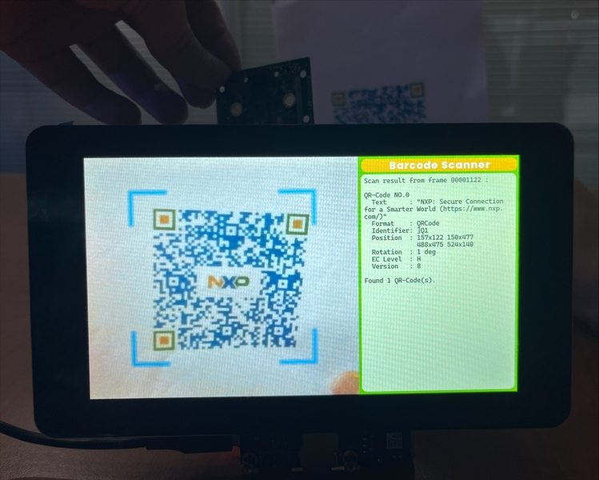
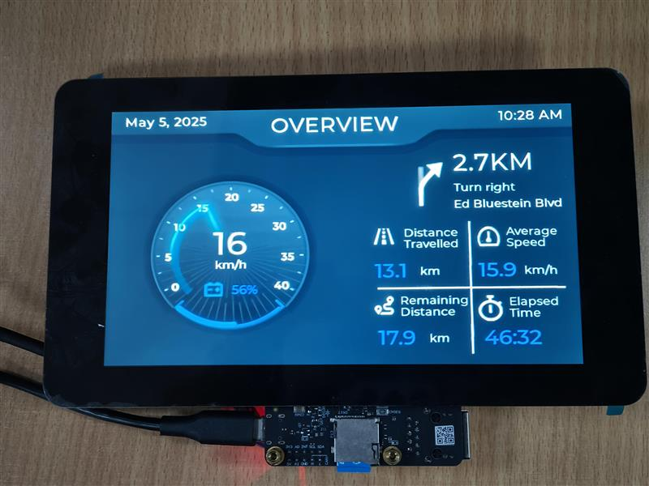

# NXP Application Code Hub

[](https://www.nxp.com)

## Zephyr demo running on i.MX93

These are Zephyr RTOS demo projects that can run on i.MX93 MPU, namely Digital Cluster Basic and Barcode Scanner. These demos maily shows the advantage of Zephyr RTOS on real-time performance, fast boot and light weight compaired to RT-Linux.

#### Boards: FRDM-IMX93

#### Categories: HMI, Graphics, RTOS

#### Peripherals: Display, Camera

#### Toolchains: Zephyr SDK

## Table of Contents

1. [Software](#step1)
2. [Hardware](#step2)
3. [Setup](#step3)
4. [Results](#step4)
5. [FAQs](#step5)
6. [Support](#step6)
7. [Release Notes](#step7)

## 1. Software<a name="step1"></a>

- [Zephyr](https://github.com/nxp-zephyr/zephyr/tree/FRDM-IMX93-v4.1)

Zephyr is an operating system that includes a HAL component.

- [Zephyr Hal](https://github.com/nxp-zephyr/hal_nxp/tree/FRDM-IMX93-v4.1)

The HAL provides an abstraction layer for interacting with hardware, allowing developers to write hardware-independent code.

- [Zephyr Sample](https://github.com/nxp-imx-support/zephyr_samples/tree/gh-release/imx93_zephyr_poc_v4.1)

The sample part indicates these are example implementations or demonstrations of how to use the Zephyr HAL.

These HAL samples help developers learn how to leverage the Zephyr HAL to build applications that can run on different hardware platforms without needing to modify the core code.

## 2. Hardware<a name="step2"></a>

- [FRDM-IMX93 board](https://www.nxp.com.cn/design/design-center/development-boards-and-designs/frdm-i-mx-93-development-board:FRDM-IMX93)
- [RPI-CAM-MIPI camera module](https://www.nxp.com.cn/design/design-center/development-boards-and-designs/ias-camera-to-rpi-camera-adapter:RPI-CAM-MIPI)
- [Waveshare 7inch DSI LCD (C) display panel](https://www.waveshare.net/shop/7inch-DSI-LCD-C.htm)
- Personal computer
- TF Card Reader
- TF Card

## 3. Setup<a name="step3"></a>

### 3.1 Step1

#### Setup Zephyr Project

To setup Zephyr project, refer to [Getting Started Guide - Zephyr Project Documentation](https://docs.zephyrproject.org/3.5.0/develop/getting_started/index.html).

Note that when running `west init ~/zephyrproject` command, use the following command instead:

```shell
$ west init -m https://github.com/nxp-zephyr/zephyr --mr FRDM-IMX93-v4.1 ~/zephyrproject
```

Other steps are the same.

### 3.2 Step2

#### Flash boot image

Prepare a SD card and insert it into SD card slot of FRDM-IMX93 board.

Find latest Linux release image from [FRDM i.MX 93 Development Board | NXP
Semiconductors](https://www.nxp.com.cn/design/design-center/development-boards-and-designs/frdm-i-mx-93-development-board:FRDM-IMX93). Scroll down and find “i.MX FRDM 93 Demo Images”. Download and
extract the zip archive, find imx-image: “imx-image-full-imx93frdm.rootfs.wic”.

Switch SW1 on FRDM-IMX93 board to 1000 for serial downloader mode. Connect
USB1_C(P2) connector to host PC with and USB cable. Provide power by connecting
POWER(P1) to a USB-PD power supply.

Flash the image to either eMMC or SD card.

Run following command to flash the eMMC:

```shell
$ uuu -b emmc_all $path_to_imx_image
```

Wait for the process to finish. Switch SW1 on FRDM-IMX93 board to 0100 for eMMC
card boot mode.

Run following command to flash the SD card:

```shell
$ uuu -b sd_all $path_to_imx_image
```

Wait for the process to finish. Switch SW1 on FRDM-IMX93 board to 1100 for SD card
boot mode.

Disconnect USB1_C(P2) and connect DEBUG(P16) to the host PC. Open both serial
console with 115200-8-1-0-0 settings.

Power cycle the board by disconnecting and reconnecting the power supply. Boot
log should appear on the first serial console.

### 3.3 Step3

#### Build Demo App

To build a demo app, first clone this repository under `~/zephyrproject` :

```shell
$ cd ~/zephyrproject
$ git clone -b gh-release/imx93_zephyr_poc_v4.1 --single-branch https://github.com/nxp-imx-support/zephyr_samples.git
```

Apply patches to zephyr:

```shell
$ cd ~/zephyrproject/zephyr
$ git am ../zephyr_samples/patches/zephyr/*
```

Then build with following commands:

```shell
$ cd ~/zephyrproject/zephyr
$ west build -b ${BOARD} ${PATH_TO_DEMO}
```

For example, to build `samples/basic/blinky` sample, use `west build -b frdm_imx93/mimx9352/a55 samples/basic/blinky`.

The result binary is `~/zephyrproject/zephyr/build/zephyr/zephyr.bin` .

### 3.4 Step4

#### Run Zephyr Demo using U-Boot

Copy the compiled `zephyr.bin` to the first FAT partition of the SD card and plug the SD card into the board. Connect to LPUART1 with the setting of `115200-8-1-0-0` via on-board debug USB. Power it up and stop the u-boot execution at prompt.

Use the following command to start `zephyr.bin` on Cortex-A55 Core0:

```shell
u-boot=> fatload mmc 1:1 0xd0000000 zephyr.bin; dcache off; icache flush; go 0xd0000000
```

### 3.5 Step 5

#### Barcode Scanner

The barcode_scanner demo runs on a single FRDM-IMX93 board. It shows preview of AR0144 MIPI-CSI camera with AP1302 ISP, scan for QR-Code and shows the info on the Waveshare 7inch DSI LCD (C) MIPI-DSI display.

Follow descriptions of chapter 3.1 in [Zephyr on A55 with FRDM-IMX93_91](https://community.nxp.com/pwmxy87654/attachments/pwmxy87654/imx-processors%40tkb/6170/1/Zephyr%20on%20A55%20with%20FRDM-IMX93_91.pdf) to connect the camera module and display panel.

Build barcode_scanner using this command:

```shell
$ west build -b frdm_imx93/mimx9352/a55 --shield="waveshare_7inch_dsi_lcd_c;nxp_rpi_cam_mipi_ap1302" ../zephyr_samples/barcode_scanner
```

Copy the `zephyr.bin` to the first FAT partition of the SD card and load with U-Boot.

#### E-bike Digital Cluster Basic

The ebike digital cluster basic demo runs on a single FRDM-IMX93 board. It displays a demo instrument panel of an E-bike on a panel with resolution 1024x600. The components on the panel are updated automatically.

Follow descriptions of chapter 3.1 in [Zephyr on A55 with FRDM-IMX93_91](https://community.nxp.com/pwmxy87654/attachments/pwmxy87654/imx-processors%40tkb/6170/1/Zephyr%20on%20A55%20with%20FRDM-IMX93_91.pdf) to connect the display panel.

Build ebike digital cluster basic demo using this command:

```shell
$ west build -b frdm_imx93/mimx9352/a55 --shield="waveshare_7inch_dsi_lcd_c" ../zephyr_samples/ebike_digital_cluster_basic/
```

Copy the `zephyr.bin` to the first FAT partition of the SD card and load with U-Boot.

## 4. Results<a name="step4"></a>

#### Barcode Scanner

When the demo runs correctly, we will see the following interfaces.



#### E-bike Digital Cluster Basic

When the demo runs correctly, we will see the following interfaces.



## 5. FAQs<a name="step5"></a>

## 6. Support<a name="step6"></a>

If you need help, please contact FAE or create a ticket to [NXP Community](https://community.nxp.com/).

#### Project Metadata

<!----- Boards ----->

[](https://github.com/search?q=org%3Anxp-appcodehub+MCIMX93-EVK+in%3Areadme&type=Repositories) [](https://github.com/search?q=org%3Anxp-appcodehub+MCIMX93-QSB+in%3Areadme&type=Repositories)

<!----- Categories ----->

[](https://github.com/search?q=org%3Anxp-appcodehub+hmi+in%3Areadme&type=Repositories) [](https://github.com/search?q=org%3Anxp-appcodehub+graphics+in%3Areadme&type=Repositories) [](https://github.com/search?q=org%3Anxp-appcodehub+rtos+in%3Areadme&type=Repositories)

<!----- Peripherals ----->

[](https://github.com/search?q=org%3Anxp-appcodehub+display+in%3Areadme&type=Repositories)

<!----- Toolchains ----->

[](https://github.com/search?q=org%3Anxp-appcodehub+gcc+in%3Areadme&type=Repositories)

Questions regarding the content/correctness of this example can be entered as Issues within this GitHub repository.

> **Warning**: For more general technical questions regarding NXP Microcontrollers and the difference in expected funcionality, enter your questions on the [NXP Community Forum](https://community.nxp.com/)

[](https://www.youtube.com/@NXP_Semiconductors)
[](https://www.linkedin.com/company/nxp-semiconductors)
[](https://www.facebook.com/nxpsemi/)
[](https://twitter.com/NXP)

## 7. Release Notes<a name="step7"></a>

| Version | Description / Update                    | Date                       |
|:-------:| --------------------------------------- | --------------------------:|
| 1.0     | Initial release                         | May 30<sup>th</sup> 2024   |
| 2.0     | Update to zephyr v4.1                   | Sep 16<sup>th</sup> 2025   |
